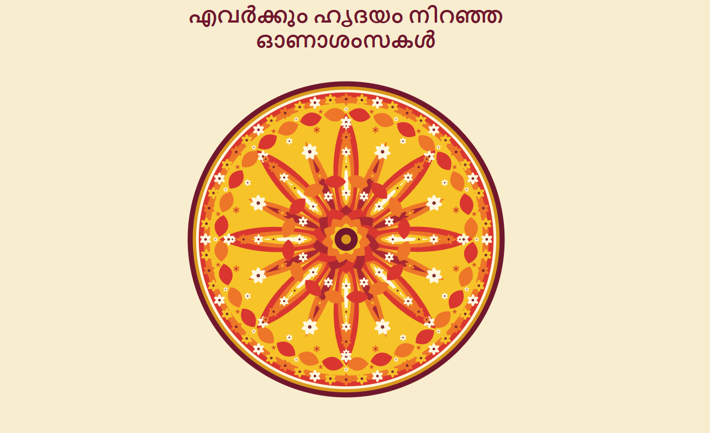

# 🌺 Code a Pookalam

An algorithmically generated digital Pookalam.

## 🌼 About

This project transforms the traditional concept of an
Athapookalam into a digital artwork using algorithms,
mathematical patterns, loops, and procedural generation.

The entire Pookalam is generated using JavaScript and
HTML Canvas without using PNG/JPG image tiles.

## ✨ Features

- 🌺 Algorithmically generated Pookalam
- 🔄 8-fold radial symmetry
- 🌸 Procedural flower generation
- 📐 Mathematical positioning using polar coordinates
- 🔁 Loop-based pattern generation
- 🎨 Layered circular floral patterns
- ✨ Animated construction
- 🖱️ Click to replay the animation
- 📱 Responsive design
- 🚫 No PNG/JPG tiles used for the artwork

## 🧠 How It Works

The Pookalam is generated completely through JavaScript
using the HTML Canvas API.

The design is based on rotational symmetry. Elements are
positioned around the centre using mathematical angles
and radial distances.

The project uses:

- `sin()` and `cos()` for circular positioning
- loops for repeated floral patterns
- polar coordinates for radial symmetry
- procedural functions for petals and flowers
- layered circles for the Pookalam structure

The eight primary sections create the main radial structure,
while secondary floral motifs are placed between them.

## 🎨 Design

The design uses an Onam-inspired colour palette:

- Yellow
- Orange
- Red
- Cream
- Maroon

The composition is intentionally circular and symmetrical,
inspired by the traditional structure of an Athapookalam.

## ✨ Animation

The Pookalam is constructed progressively through animation.

Different layers appear one after another, representing
the process of building a Pookalam through code.

Clicking the Pookalam replays the animation.

## 🛠️ Technologies

- HTML5
- CSS3
- JavaScript
- HTML Canvas

## 🚫 Assets

The Pookalam artwork is generated entirely through code.

No PNG/JPG image tiles or pre-made image assets are used
to construct the Pookalam.

The screenshot included in this repository is only a preview
of the generated artwork.

## ▶️ How to Run

1. Download or clone this repository.
2. Keep the following files in the same folder:

   - `index.html`
   - `style.css`
   - `script.js`

3. Open `index.html` in a modern web browser.

## 📸 Preview

## 🌺 Onam

Onam is a celebration of togetherness, creativity,
and joy.

This project represents that spirit through symmetry,
repetition, colour, and code — **one loop at a time.**

---

Made with algorithms, creativity, and the spirit of Onam. 🌺💻
